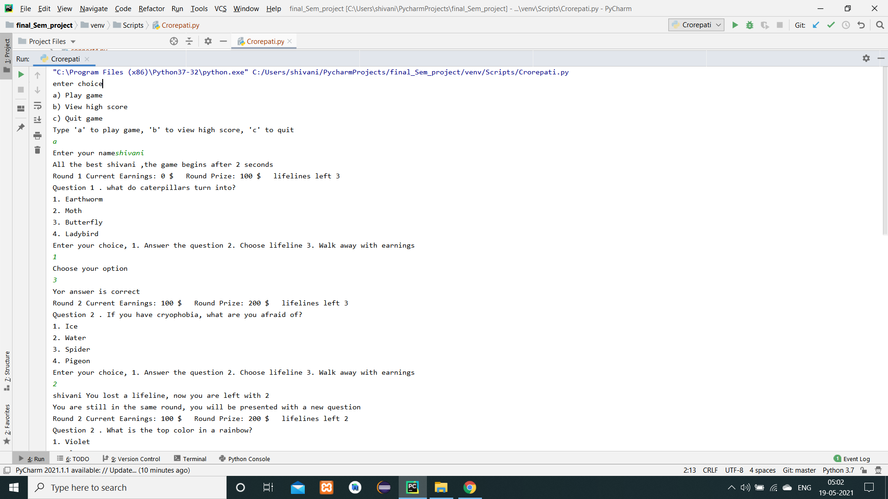
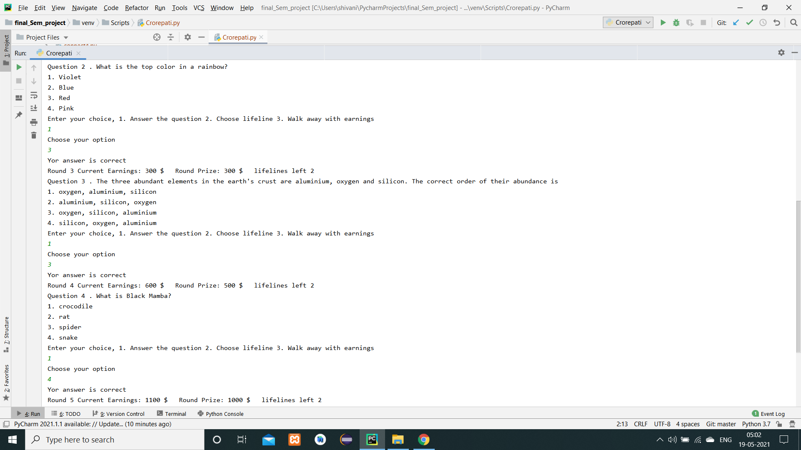
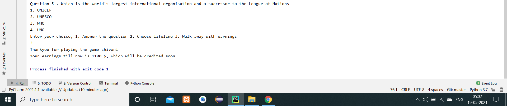

## Working

* "Who wants to be a millionaire" uses Python and is a console-based project. 
* The game starts with the program first asking the name of the user. 
* There are 3 levels of questions: Easy, Average, Difficult. Dictionaries are used to store questions and answers. 
* Questions are randomly selected. Each question has 4 choices. 
* At the start of each round, a question alongwith its options is flashed. 
* Current earnings, number of lifelines left and round prize is also displayed. 
* User has 3 options, 
  1. he can use a lifeline and move onto the next question
  2. he can answer
  3. he can walk away with the earnings
* For average and difficult level questions, after the user has typed in the option, game must ask him to confirm his choice
* If the answer is not correct, he walks away with the price earned at the last checkpoint

 

## Output

 
